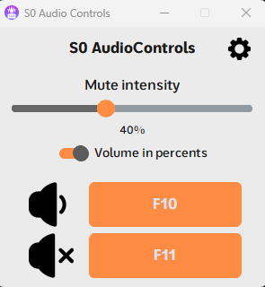

# S0's Audio Controls
S0AC is a tool to make a simple QOL change in your computer - with it you can mute your focused app, decrease app's volume in general and by percentage, creating 'ear plug effect'.
# Language and Themes
Currently app is supporting three languages: English, Russian and Ukrainian. App has 19 themes and comfortable tray foldage system, making it able to work without having on screen.
# Foldable GUI
After closing or folding the app for the first time, you'll get a simple notification, telling you it's running in background. You can access S0AC anytime by clicking it's tray icon.
# App usage
To install S0AC you simply have to unpack it to any comfortable folder and start S0AC.exe or main.py.\n
After installing the app you can add it into Windows Startup to load automatically when starting your computer.\n
Whenever you want to mute or increase/decrease any app's volume - press the hotkey while your app is in focus. To change the hotkey - simply press the button in GUI and click the more preferred one on your keyboard. In case of any conflicts or errors S0AC will automatically change the hotkey to the default one.
# Theme preview
